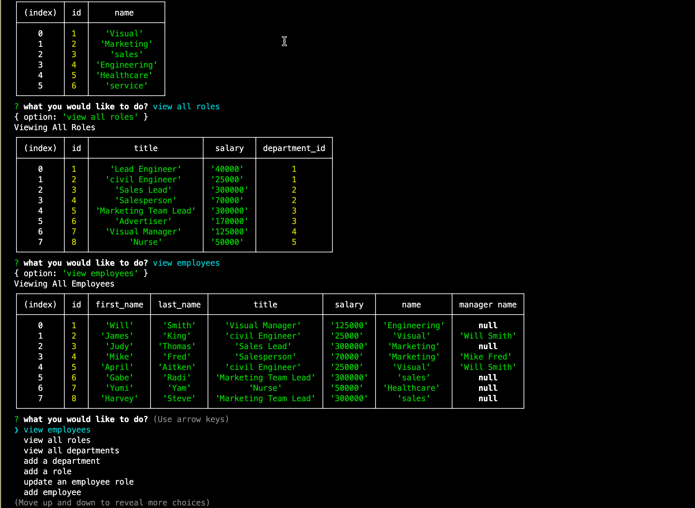
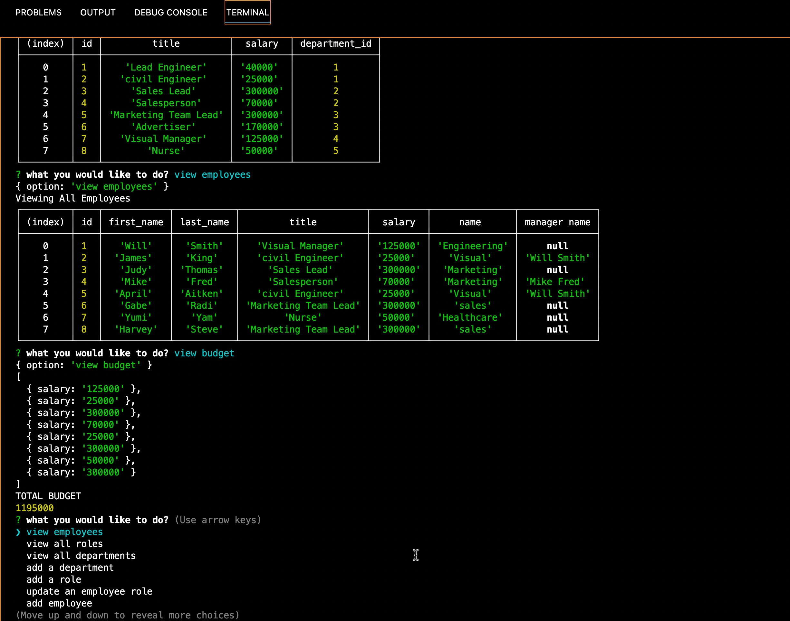

# Employee-Tracker

# Description
This is a straightforward application that creates an employee database in MySQL and
 associates each employee with the job title, salary, department, and manager..etc.

 # Installation
1. Clone repository to your local system
2. Open in VS code
3. run a npm install in server.js integrated terminal
4.Copy DB files and paste them in your mySQL to create database and pre-populate it
5.run npm start in server.js integrated terminal

# Usage

1. view employees, view all roles, view all departments,
2. add a department, add a role, update an employee role, 
3. add employee, remove employee, remove role, view budget.

# Mock-Up

# video link
https://drive.google.com/file/d/1ElCfE6fC8D4RZuE7AVDeth0xj8UgnGjy/view?usp=sharing

